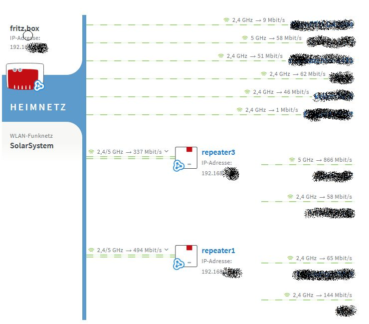

# Fritz Mesh
Proxy daemon to show the Fritz!Box mesh overview outside of the regular Fritz!Box user interface.
  
E.g. to include it in an Home Assistant Dashboard:

This repo is originally copied from https://github.com/Lamarqe/fritzmesh.git and adapted to my own needs. Thanks to [Lamarqe](https://github.com/Lamarqe)!

Functionalities offered:

 * Extract the Fritz Mesh renderer from the Fritz!Box WebUI
 * Modify some css / js parameters to make the overview appear in fullscreen
 * Cache the modified data locally
 * Mesh status is updated every 5 seconds

## Environment

You can run the software in a range of different environments:

1. Docker container - that is my standard env
2. Home Assistant - that is initially setup by [Lamarqe](https://github.com/Lamarqe), obviously
1. Plain Python environment - ...

## Configuration

Edit `fritzmesh` to your needs:
 * `fritzboxUsername`: The username of your Fritz!Box
 * `fritzboxPassword`: Corresponding users password
 * `fritzboxHost`: Hostname or IP under which the Fritz!Box is reachable
 * `fritzMeshPort`: The local port of the hosting server under which the fritz mesh overview will be made available 

 Alternatively introduce environment variables to the docker-compose.yml:
 * `FRITZBOXUSERNAME`: The username of your Fritz!Box
 * `FRITZBOXPASSWORD`: Corresponding users password
 * `FRITZBOXHOST`: Hostname or IP under which the Fritz!Box is reachable
 * `FRITZMESHPORT`: The local port of the hosting server under which the fritz mesh overview will be made available 

 You can introduce both, `fritzmesh` and env vars, but the env vars take precedence.

 Edit `docker-compose.yml`, basically:
 
 * `ports`
 * `env_file`

 ## Installation

Additionally to Python 3 itself, Fritz Mesh uses the libraries Requests and AIOHTTP.

To install Fritz Mesh in a docker environment:
 * Clone or download the project.
 * Install, using `docker compose up -d`

## Usage

After installation, access with a browser of your choice the Mesh Overview UI at `http://<yourddaemonhost>:<fritzMeshPort>`
